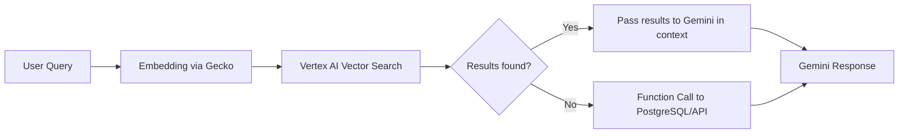

# **PoC TravelForge – Progetto "TravelForge Spark"** - Introduzione

**Obiettivo**: In 7 settimane realizzare una piattaforma di travel tech che fornisca un’esperienza fluida e personalizzata: l’utente indica meta e durata (es. Berlino, 5 giorni) e ottiene un pacchetto completo di informazioni e strumenti AI-driven.

---

## 1. Elenco sintetico delle Features

* Tourism Data Integrator
* Itinerary Auto-Builder
* Ticket Price Estimator
* Events & Nightlife Module
* Car Sharing & Mobility
* Accommodation Advisor
* Home Exchange Matcher
* Travel Leaderboard
* Smart Alerts & Links
* Interactive Demo UI

---

## 2. Descrizione Funzionale Agenti Intelligenti e Automazioni

### 2.1 Itinerary Auto-Builder Agent

* **Input**:
  * Destinazione
  * Durata
  * Stagione
  * Preferenze: tipo di viaggio (culturale, relax spiaggia o montagna, on the road, safari, ...)
* **Tecnologia**:
  * gpt-4o-mini
  * **Pipeline NLP Custom**: è il modulo core della nostra applicazione, si occupa di recuperare e utilizzare tutti i dati che servono
  * **Fine tuning**: fornire risposte migliori grazie ai dati forniti dai provider (trasporti, attività, eventi, ...)
* **Output**: schema itinerario giornaliero, con link ufficiali e timeframe
* **Funzioni**:

  * Generazione schema base
  * Traduzione e localizzazione contenuti
  * Inclusione tappe AI-ranked

### 2.2 Tourism Data Integrator (RPA Agent)

* **Input**:
  * Città
* **Tecnologia**:
  * Puppeteer (utile per automazione scraping)
  * OCR (Optical Character Recognition Google per data ingestion da documenti di diverso formato)
  * Cron Scheduler
* **Output**: dataset attrazioni, musei, orari, prezzi aggiornati
* **Funzioni**:

  * Scraping portali ufficiali (Visit City, Nostracultura)
  * Parsing HTML, PDF e contenuti dinamici
  * Normalizzazione dati e validazione

### 2.3 Ticket Price Estimator Agent

* **Input**: 
  * Elenco attività/attrazioni
  * Date
* **Tecnologia**: RPA scraping + regressione costi
* **Output**: tabella prezzi e stima costo viaggio
* **Funzioni**:

  * Raccolta prezzi da siti ufficiali o piattaforme prenotazione
  * Stima costi mancanti tramite modello AI (**MAPE ≤ 12%**)
 
**MAPE (Mean Absolute Percentage Error)** — metrica valutazione precisione per un modello di previsione

📌 **Definizione:**

$$
\text{MAPE} = \frac{100\%}{n} \sum_{i=1}^{n} \left|\frac{\text{Valore Reale}_i - \text{Valore Predetto}_i}{\text{Valore Reale}_i}\right|
$$

In parole semplici:

* Confronta i valori previsti con quelli reali.
* Calcola l’errore in percentuale per ogni osservazione.
* Fa la media.

📊 **MAPE ≤ 12%**
Vuol dire che, in media, l’errore percentuale tra le tue previsioni e i valori reali deve essere **al massimo del 12%**.
In altre parole, il tuo modello è considerato abbastanza accurato se:

$$
\text{MAPE} \le 12\%
$$


### 2.4 Events & Nightlife Agent

* **Input**:
  * Città
  * Data
  * Interessi utente
* **Tecnologia**:
  * Scraping
  * Embedding
  * Filtro AI
* **Output**: eventi rilevanti con info e link
* **Funzioni**:

  * Parsing di Eventbrite, Meetup, siti locali
  * Raccomandazione semantica eventi simili

### 2.5 Mobility Aggregator Agent

* **Input**:
  * Città
  * Data
* **Tecnologia**: API calls + scraping
* **Output**: tabella con tariffe car/bike/scooter sharing
* **Funzioni**:

  * Comparazione multi-provider (ShareNow, Lime, ecc.)
  * Previsione disponibilità per fascia oraria

### 2.6 Home Exchange Matcher Agent

* **Input**:
  * profilo host
  * profilo viaggiatore
* **Tecnologia**:
  * Similarity Matching (embeddings + filtri logici)
* **Output**: coppie compatibili per scambio
* **Funzioni**:

  * Matching preferenze / date / tipo alloggio
  * Classificazione qualità match (score > soglia)

### 2.7 Smart Notification Engine

* **Input**:
  * Profilo utente
  * Itinerario salvato
  * Dati prezzo
  * Dati eventi
* **Tecnologia**: 
  * Rule-based
  * AI thresholding
* **Output**: alert push/email su variazioni rilevanti
* **Funzioni**:

  * Trigger su soglie prezzo
  * Notifiche eventi imminenti o nuovi

### 2.8 TravelGPT Chat Agent

* **Input**: 
  * Domanda generica o contestuale
* **Tecnologia**: 
  * GPT-4o + RAG (opzionale con Vector DB)
* **Output**: risposte precise su viaggio, attività, cultura locale
* **Funzioni**:

  * Risposte grounding su contenuti reali
  * Integrazione con knowledge base da scraping/API

---

Perfetto, aggiorniamo il documento focalizzandoci sul **requisito strategico di costruire una Knowledge Base (KB)** per aumentare **precisione, affidabilità e ricchezza delle risposte**, soprattutto per:

---

## 3. Ambito e Funzionalità

| Feature                       | Descrizione                                                                                                                                          | Valore Creativo                         |
| ----------------------------- | ---------------------------------------------------------------------------------------------------------------------------------------------------- | --------------------------------------- |
| **Tourism Data Integrator**   | Bot RPA per scraping di dati ufficiali (siti city portal, nostracultura.it) su musei, orari, prezzi, eventi in corso; normalizzazione e update       | Dati affidabili e sempre aggiornati     |
| **Itinerary Auto-Builder**    | Microservizio AI che genera itinerari personalizzati: durata, preferenze, budget. Includere mappe, foto, link di riferimento e timeframe giornalieri | Itinerario dettagliato e pronto all’uso |
| **Ticket Price Estimator**    | Modulo AI/RPA per estrazione prezzi biglietti (musei, attrazioni) e stima costo totale, corretta in real-time                                        | Preventivo realistico e dinamico        |
| **Events & Nightlife Module** | Servizio AI che recupera eventi (concerti, mostre) e luoghi serali (bar, discoteche) con filtri per data e gusti utente                              | Esperienze di viaggio personalizzate    |
| **Car Sharing & Mobility**    | RPA per aggregare tariffe car sharing, bike/e-scooter sharing e rental car; visualizzazione costi e disponibilità                                    | Mobilità integrata e confrontabile      |
| **Accommodation Advisor**     | AI-driven consigli su zone migliori per alloggio (musei vs nightlife), periodo migliore per viaggiare, portali di prenotazione                       | Scelta più adatta a esigenze e budget   |
| **Home Exchange Matcher**     | Matching AI tra host e viaggiatori per scambio case ottimale: preferenze, date, zona                                                                 | Aumento delle opportunità di scambio    |
| **Travel Leaderboard**        | Dashboard gamificata con badge ("Explorer Pro", "Local Host"), punti basati su utilizzo moduli e feedback                                            | Engagement, retention e viralità        |
| **Smart Alerts & Links**      | Notifiche push su offerte lampo, variazioni prezzo, eventi imminenti, con link diretti ai siti di prenotazione e alle mappe interattive              | Proattività e click-through immediato   |
| **Interactive Demo UI**       | Frontend Angular + Tailwind con interfaccia fluida: input meta/tempo, mappe dinamiche, drag\&drop per custom itinerari e preview “immersive”         | Esperienza utente premium e intuitiva   |

## Architettura PoC

1. **Backend**: FastAPI + Python (scikit-learn, Pandas, Hugging Face Transformers)
2. **Data Store**: PostgreSQL (utenti, itinerari, case, eventi) + Redis (cache offerte, previsioni)
3. **AI Service**:

   * Itinerary generation (seq2seq + GPT fallback)
   * Recommendation (matching preferences)
   * Regression per stima costi
   * NLP per eventi, nightlife e recensioni
4. **RPA Module**: Containerizzati (Puppeteer + OCR) per scraping:

   * Tourism portals (Visit Berlin, City APIs)
   * Event calendars (Eventbrite, Meetup)
   * Car sharing APIs (ShareNow, Lime)
5. **Frontend**: Angular + Tailwind (Itinerary Builder, Event Explorer, Mobility Dashboard, Leaderboard)
6. **Orchestrazione**: Kubernetes (API, AI, RPA agent, Redis)
7. **CI/CD**: GitHub Actions (build, lint, test, deploy su dev e staging)
8. **Monitoring**: Prometheus & Grafana (metriche API e RPA)

---

## 4. Functional Prototype: Backend Itinerary Service

**Obiettivo**: Implementare in Python un endpoint FastAPI che, dati in input `city_country`, `duration_days`, `season_or_dates`, restituisca:

1. **Galleria Immagini**: Le foto più significative (attrazioni, spiagge, architettura), ottenute tramite API di image search (es. Unsplash o Google Custom Search).
2. **Report Itinerario Markdown**:

   * Itinerario giorno-per-giorno con link ufficiali (siti musei, tour operator, city portal).
   * Preventivo costi: tabella con dettaglio prezzi (biglietti musei, attività, trasporti) e totale.
   * Link diretti ai provider per prenotazione (biglietti, hotel, car sharing).
3. **Meccanismo di Function Calling**:

   * Chiamata a GPT tramite l’API OpenAI con `functions` per:

     * Generare schema itinerario base.
     * Estrarre keyword per ricerca immagini e prezzi.
   * Pipeline custom in Python per:

     * Eseguire scraping o chiamate API a siti ufficiali.
     * Validare e normalizzare i prezzi (evitando dati errati o inventati).

### 4.1 Input e Output

* **Input JSON**:

```json
{
  "city_country": "Las Americas, Tenerife",
  "duration_days": 10,
  "season_or_dates": {"season": "estate", "from": "2025-08-10", "to": "2025-08-20"}
}
```

* **Output Markdown**:

```markdown
# Itinerario per Las Americas, Tenerife (10 giorni, 10-20 agosto 2025)

## 📸 Galleria Immagini


...

## 🗓️ Itinerario Giornaliero
| Giorno | Attività                        | Link                                                |
| ------ | ------------------------------- | --------------------------------------------------- |
| 1      | Escursione al Mount Teide       | https://www.volcanoteide.com                        |
| 2      | Visita Loro Parque              | https://www.loroparque.com/tickets                   |
...

## 💰 Preventivo Costi
| Voce                  | Prezzo (€) |
| --------------------- | ---------- |
| Mount Teide           | 25         |
| Loro Parque           | 35         |
| Car sharing (giornaliero) | 40      |
| **Totale Stimato**    | **1000**   |

## 🔗 Link Prenotazione
- Biglietti Mount Teide: https://www.volcanoteide.com
- Car sharing: https://www.sharenow.com
```

### 4.2 Architettura e Pipeline

1. **Endpoint FastAPI** `/generate-itinerary`
2. **Service Layer**:

   * `gpt_client.call_functions()` per struttura base itinerario
   * `image_service.search_images(keywords)`
   * `pricing_service.fetch_prices(items, dates)`
   * `markdown_builder.build_report(data)`
3. **Data Validation**: Controlli su prezzi e link (schema JSON + regex sui domini ufficiali).
4. **Caching**: Redis per risposte di image search e price fetch per 1h.

---

### 4.3 Backend Deliverables

1. **Backend**: FastAPI + Python (scikit-learn, Pandas, Hugging Face Transformers)
2. **Data Store**: PostgreSQL (utenti, itinerari, case, eventi) + Redis (cache offerte, previsioni)
3. **AI Service**:

   * Itinerary generation (seq2seq + GPT fallback)
   * Recommendation (matching preferences)
   * Regression per stima costi
   * NLP per eventi, nightlife e recensioni
4. **RPA Module**: Containerizzati (Puppeteer + OCR) per scraping:

   * Tourism portals (Visit Berlin, City APIs)
   * Event calendars (Eventbrite, Meetup)
   * Car sharing APIs (ShareNow, Lime)
5. **Frontend**: Angular + Tailwind (Itinerary Builder, Event Explorer, Mobility Dashboard, Leaderboard)
6. **Orchestrazione**: Kubernetes (API, AI, RPA agent, Redis)
7. **CI/CD**: GitHub Actions (build, lint, test, deploy su dev e staging)
8. **Monitoring**: Prometheus & Grafana (metriche API e RPA)


## 5. Timeline & Deliverables (7 settimane)

| Settimana | Attività                                                                                                                                    | Deliverable                            |
| --------- | ------------------------------------------------------------------------------------------------------------------------------------------- | -------------------------------------- |
| 1         | Ambiente, schema DB (utenti, destinazioni, itinerari, eventi, case), stub API RPA/AI, autenticazione base                                   | Repo iniziale, DB schema, auth stub    |
| 2         | **Tourism Data Integrator**: bot scraping musei, attrazioni, orari, prezzi; API per dati culturali                                          | Servizio scraping + esempi dataset     |
| 3         | **Itinerary Auto-Builder**: modello NLP + GPT fallback, generazione itinerari base; integrazione mappe e foto via API esterna               | Microservizio itinerari, endpoint demo |
| 4         | **Ticket Price Estimator**: RPA extraction prezzi biglietti + regressione costi totali; integrazione link ufficiali                         | API stima costi + test accuracy        |
| 5         | **Events & Nightlife Module**: scraping eventi in corso, raccomandazioni locali, AI filter per gusti; sviluppo UI lista eventi              | Servizio eventi + UI prototipo         |
| 6         | **Car Sharing & Accommodation Advisor**: RPA price aggregator car sharing; AI consigli zone e periodi; Home Exchange Matcher                | Mobility dashboard + matching service  |
| 7         | **Gamification Engine** + **Interactive Demo UI**: leaderboard, notifiche, link diretti, test end-to-end, documentazione, presentazione PoC | UI completa, report PoC, demo live     |
                             |
## 6. Metriche di Successo

* **Fluidità UX**: <2 click per ottenere itinerario completo
* **Accuratezza dati culturali** ≥ 95%
* **Soddisfazione Itinerario** ≥ 85%
* **Precisione stima prezzo** MAPE ≤ 12%
* **Matching Accuracy** ≥ 75%
* **Engagement Gamification** ≥ 60% utenti attivi
* **Tempo totale elaborazione** < 15s per richiesta

---

# TravelForge Spark – Documentazione API & Agenti Intelligenti

## 7. Descrizione delle API REST Necessarie

### 7.1 Autenticazione e Gestione Utenti

| Metodo | Endpoint              | Descrizione                           |
| ------ | --------------------- | ------------------------------------- |
| POST   | /auth/register        | Registrazione nuovo utente            |
| POST   | /auth/login           | Login utente                          |
| GET    | /users/me             | Profilo dell'utente autenticato       |
| PUT    | /users/me/preferences | Aggiorna preferenze di viaggio utente |

---

### 7.2 Generazione Itinerario

| Metodo | Endpoint            | Descrizione                                                  |
| ------ | ------------------- | ------------------------------------------------------------ |
| POST   | /generate-itinerary | Genera un itinerario AI-driven per una destinazione e durata |
| GET    | /itineraries/{id}   | Recupera un itinerario specifico                             |
| GET    | /itineraries/user   | Recupera tutti gli itinerari dell’utente                     |

---

### 7.3 Modulo Prezzi e Prenotazioni

| Metodo | Endpoint                    | Descrizione                                  |
| ------ | --------------------------- | -------------------------------------------- |
| POST   | /pricing/estimate           | Stima costo attività, musei, trasporti, etc. |
| GET    | /pricing/history/{location} | Storico prezzi attrazioni e trasporti        |

---

### 7.4 Modulo Eventi e Nightlife

| Metodo | Endpoint                | Descrizione                                                  |
| ------ | ----------------------- | ------------------------------------------------------------ |
| GET    | /events/{city}          | Recupera eventi in corso filtrati per data, categoria, gusti |
| GET    | /events/recommendations | Suggerisce eventi in base a profilo utente                   |

---

### 6.5 Mobilità e Alloggi

| Metodo | Endpoint              | Descrizione                                        |
| ------ | --------------------- | -------------------------------------------------- |
| GET    | /mobility/options     | Tariffe e disponibilità car/bike/scooter sharing   |
| GET    | /accommodation/advice | Zone consigliate per alloggio in base a preferenze |
| POST   | /home-exchange/match  | Matching per scambio casa                          |

---

### 7.6 Gamification e Notifiche

| Metodo | Endpoint           | Descrizione                                       |
| ------ | ------------------ | ------------------------------------------------- |
| GET    | /leaderboard       | Classifica utenti per badge, punteggio e attività |
| GET    | /alerts/{user\_id} | Notifiche smart su offerte, eventi, cambi prezzi  |

---

### 7.7 Immagini e Contenuti

| Metodo | Endpoint              | Descrizione                                |
| ------ | --------------------- | ------------------------------------------ |
| GET    | /images/search        | Cerca immagini per destinazione/tema       |
| GET    | /content/links/{type} | Link utili per prenotazione e informazioni |

---

### 🎯 Obiettivi della KB

1. **Precisione prezzi** (ingressi musei, attrazioni, trasporti locali)
2. **Ricchezza culturale e operativa** (cosa fare, orari, link ufficiali, eventi)

---

### 🔧 Strategia Tecnologica per la KB

| Aspetto            | Scelta Tecnologica                                                 | Motivazione                                                       |
| ------------------ | ------------------------------------------------------------------ | ----------------------------------------------------------------- |
| **Storage base**   | Vector DB (es. Weaviate, Qdrant, Pinecone)                         | Permette embedding, similar search, domande e retrieval semantico |
| **Fallback**       | PostgreSQL (relazionale, dati strutturati: orari, prezzi certi)    | Per avere certezza su prezzi fissi/valori tabellari               |
| **Indicizzazione** | Embedding con modelli tipo `all-MiniLM` o `text-embedding-3-small` | Ottimale per semantica breve, costi bassi                         |

---

### 📘 Contenuti da Inserire nella KB

| Categoria         | Fonte                                        | Metodo Raccoglimento               | Frequenza Update |
| ----------------- | -------------------------------------------- | ---------------------------------- | ---------------- |
| Musei & Monumenti | Portali ufficiali città, NostraCultura       | Scraping via RPA (Puppeteer + OCR) | 1/settimana      |
| Prezzi ingressi   | API ufficiali o scraping (es. Teide, Louvre) | RPA + validazione su portali       | 1/settimana      |
| Eventi temporanei | Eventbrite, Meetup, City Calendar            | API quando disponibili, o scraping | 1-2/giorni       |
| Attività outdoor  | Blog, city guides, Tripadvisor               | NLP + estrazione da testi HTML     | 1-2/settimane    |
| Recensioni / Tips | Google Maps, blog viaggi                     | Embedding + NLP                    | continuo (delta) |

---

### 🧠 Funzionalità Supportate dalla KB

| Use Case                                   | Meccanismo                                                 |
| ------------------------------------------ | ---------------------------------------------------------- |
| "Quanto costa entrare al Museo Egizio?"    | Query semantica + fallback su prezzo da tabella verificata |
| "Cosa vedere a Berlino in 3 giorni?"       | Retrieval attività + matching per durata e priorità        |
| "Ci sono eventi jazz a Lisbona in agosto?" | Ricerche event-centriche con filtro semantico + temporale  |
| "Quali attrazioni sono aperte di sera?"    | KB orari + filtro semantico su fascia oraria               |

---

### 🧩 Integrazione con GPT

* **Retrieval-augmented generation (RAG)**: il sistema recupera chunk semantici rilevanti da vector DB → questi vengono passati nel `context` al GPT (es. GPT-4o mini) per generare la risposta.
* **Function Calling con fallback**: se il contenuto non è in KB, GPT può chiamare una `function` per attivare scraping / API provider.

---

### 🔄 Pipeline di Popolamento KB

1. **Scraper agents**:

   * Navigano portali di città / cultura
   * Estraggono nome, descrizione, orari, prezzo, link ufficiale
   * Normalizzazione dati in formato JSON

2. **NLP agents**:

   * Estraggono keyword da articoli/blog
   * Embedding + tagging semantico
   * Identificazione eventi o attività emergenti

3. **Scheduler & Validator**:

   * Cron settimanale per musei & attrazioni
   * Daily fetch per eventi
   * Verifica automatica link e coerenza prezzi

---

### 📂 Struttura Dati KB (semplificata)

```json
{
  "type": "museo",
  "title": "Museo Egizio di Torino",
  "location": "Torino, Italia",
  "description": "Uno dei più antichi musei egizi del mondo...",
  "category": ["cultura", "storico"],
  "tags": ["egizio", "archeologia", "storico"],
  "price": 18,
  "opening_hours": {
    "lun": "09:00-18:30",
    "mar": "09:00-18:30",
    ...
  },
  "official_link": "https://museoegizio.it",
  "embedding": [/* vector */]
}
```


### 🎯 Spiegazione campi chiave

| Campo       | Scopo                                                           |
| ----------- | --------------------------------------------------------------- |
| `content`   | Testo semantico da embeddare → usato per similar search         |
| `embedding` | Vettore numerico calcolato con modello embedding                |
| `metadata`  | Filtraggio / faceting (es. per città, categoria, prezzo, orari) |
| `id`        | Utile per gestione update o deduplicazione                      |

---

### 🧠 Come funziona nel retrieval

* **Query dell’utente** viene trasformata in embedding → `similarity search` nel Vector DB su `content`.
* **Filtri secondari** (es. `location == Torino`, `price < 20`) applicati su `metadata`.
* Risultati → forniti a GPT via `context` nel RAG.

---

### 🔁 Se usi DB ibrido (Vector + Relazionale)

* Vector DB → `descrizioni`, `esperienze`, `cosa fare`, `raccomandazioni`
* Relazionale (PostgreSQL) → `prezzi`, `orari`, `URL`, dati con **precisione numerica o regole chiare**

---

### ✅ Best practices

* Normalizza `content` per essere **autosufficiente** anche fuori dal JSON (es. nei chunk RAG)
* Aggiungi un campo `updated_at` se prevedi refresh periodici
* Non mettere l’`embedding` se viene calcolato in fase di inserimento (alcuni DB lo supportano)

---

Se vuoi posso fornirti uno **script di ingestione** (es. Python con Qdrant o Weaviate SDK) o un **template di schema** per iniziare. Vuoi procedere in quella direzione?

---


Ottima osservazione — sì, **il filtraggio temporale è possibile** in molte implementazioni di Vector DB **grazie ai campi di metadata**. Ti spiego meglio.

---

### 🕒 **Cos’è il filtraggio temporale**

Nel contesto di una **Knowledge Base turistica** e di un **vector DB**, il *filtraggio temporale* significa **limitare i risultati semanticamente simili** a quelli che:

* si **svolgono in una certa data/finestra temporale**
* sono **validi solo in certi periodi**
* hanno **scadenze**, **periodi di apertura stagionali**, ecc.

---

### 📦 Esempi pratici

#### 1. **Eventi temporanei**

```json
"metadata": {
  "start_date": "2025-08-02",
  "end_date": "2025-08-04",
  "location": "Lisbona",
  ...
}
```

➡️ Query: *"Ci sono eventi jazz a Lisbona in agosto?"*

→ Il sistema applica filtro semantico **+**

```sql
WHERE location = 'Lisbona' AND start_date <= '2025-08-31' AND end_date >= '2025-08-01'
```

---

#### 2. **Attrazioni stagionali**

```json
"metadata": {
  "seasonal_opening": {
    "from": "2025-05-01",
    "to": "2025-09-30"
  },
  ...
}
```

➡️ Query: *"Cosa posso fare all’aperto a Ginevra a novembre?"*

→ L’AI filtra solo ciò che è **aperto a novembre**, anche se semanticamente simile.

---

#### 3. **Validità temporanea di un prezzo o offerta**

```json
"metadata": {
  "price": 12,
  "price_valid_until": "2025-08-31"
}
```

→ Il sistema può evitare di suggerire un prezzo **scaduto**, anche se il contenuto è semanticamente rilevante.

---

### ✅ Come funziona il filtraggio nei Vector DB

I principali DB vettoriali come **Qdrant**, **Weaviate**, **Pinecone** supportano:

* **Filtri numerici e temporali** su `metadata`
* Query tipo:

  ```python
  filter={
    "must": [
      {"key": "location", "match": {"value": "Lisbona"}},
      {"key": "start_date", "lte": "2025-08-31"},
      {"key": "end_date", "gte": "2025-08-01"}
    ]
  }
  ```
* L’embedding serve per *trovare il concetto*, il filtro *limita per tempo, spazio, tipo*

---

### 🧩 RAG + Filtraggio temporale

Nel contesto **RAG + GPT**:

1. Query utente → embedding + parsing di entità temporali (`in agosto`, `di sera`, `weekend`)
2. Filtraggio KB per date
3. Passaggio solo dei chunk *attuali o futuri*
4. Risposta generata con contesto aggiornato

---

### 🛠 Suggerimenti per implementazione

* Usa sempre formato ISO (`YYYY-MM-DD`)
* Inserisci sia `start_date` sia `end_date` per eventi
* Per aperture ricorrenti (es. ogni estate), puoi anche usare:

  ```json
  "opening_season": ["giugno", "luglio", "agosto"]
  ```

  o un campo custom che poi mappi dinamicamente

---


Ottima domanda. La risposta è: **dipende dall'architettura del tuo sistema**, ma **sì, in un sistema RAG controllato, sei tu a definire le query di ricerca semantica e i filtri (es. temporali)** — **non GPT**.

Ti spiego tutto chiaramente 👇

---

### 🎯 1. **Chi definisce le query nel sistema RAG?**

In un sistema **Retrieval-Augmented Generation (RAG)**:

* GPT **non cerca direttamente nella KB o nel Vector DB**
* È il **tuo orchestratore** (backend, agente, o middle layer) a:

  1. Ricevere la domanda dell’utente
  2. **Estrarre intenti, entità, date, categorie**
  3. **Costruire la query vettoriale + filtri**
  4. Eseguire la ricerca nel Vector DB
  5. Passare i risultati a GPT come contesto

✅ **Quindi sì, sei tu a definire come formulare le query.**

---

### 🧠 2. Come si costruisce una **query efficace**?

Una query al vector DB si compone di:

1. **Embedding della domanda**: generato con modello tipo `text-embedding-3-small`
2. **Filtri nei metadata** (temporali, geografici, per categoria)
3. **Limite risultati**, soglia di similarità, ecc.

#### ✅ Esempio (Qdrant)

```python
query_vector = embed("Eventi jazz a Lisbona in agosto")

results = qdrant_client.search(
    collection_name="turismo",
    query_vector=query_vector,
    limit=5,
    filter={
        "must": [
            {"key": "location", "match": {"value": "Lisbona"}},
            {"key": "tags", "match": {"value": "jazz"}},
            {"key": "start_date", "lte": "2025-08-31"},
            {"key": "end_date", "gte": "2025-08-01"}
        ]
    }
)
```

---

### 🔎 3. Come estrarre automaticamente i filtri dalla domanda?

Puoi usare:

* **Named Entity Recognition (NER)**: per città, date, attività
* **Regex + parser temporali** (tipo `dateparser` o `Duckling`)
* **Intent detection + mapping semantico** (es. "in agosto" → range date)

> 🔧 Oppure usare GPT stesso (in function calling) per estrarre `intent`, `location`, `periodo`, `tipo evento`, ecc.

#### Esempio:

Prompt:

> "Ci sono eventi jazz a Lisbona in agosto?"

Output GPT (function-callable):

```json
{
  "query_text": "eventi jazz a Lisbona",
  "filters": {
    "location": "Lisbona",
    "tags": ["jazz"],
    "date_range": {
      "from": "2025-08-01",
      "to": "2025-08-31"
    }
  }
}
```

---

### 🧩 4. Quando GPT può *chiamare* una query?

Se usi **function calling**, GPT può:

* **Invocare una funzione "search\_kb"** con parametri come testo + filtri
* Tu gestisci l'esecuzione vera e propria nel vector DB

Esempio di function definita:

```json
{
  "name": "search_kb",
  "description": "Cerca nella knowledge base contenuti turistici",
  "parameters": {
    "type": "object",
    "properties": {
      "query": { "type": "string" },
      "location": { "type": "string" },
      "start_date": { "type": "string", "format": "date" },
      "end_date": { "type": "string", "format": "date" }
    },
    "required": ["query"]
  }
}
```

---

### ✅ In sintesi: cosa devi definire tu

| Cosa                            | Va definito da te? | Come                                              |
| ------------------------------- | ------------------ | ------------------------------------------------- |
| Embedding della query           | ✅                  | Usa modello (es. OpenAI `text-embedding-3-small`) |
| Filtri semantici/temporali      | ✅                  | Parsati da NER, regex, o GPT                      |
| Costruzione query Vector DB     | ✅                  | Via SDK o API (Qdrant, Pinecone, Weaviate...)     |
| Threshold / score di similarità | ✅                  | In base ai test: es. `score > 0.75`               |
| Chiamata GPT con i risultati    | ✅                  | I chunk vanno passati nel `context` per RAG       |

---

Se vuoi, posso generarti uno **scheletro Python completo per una query filtrata Qdrant** oppure un **flow tipo per orchestrazione con GPT + Vector Search + RAG**. Vuoi uno di questi esempi concreti?

---

Perfetto. Ti rispondo in due parti:

---

## 🧠 1. **Esempi di Query Semantiche (con o senza dati strutturati)**

### ✅ A. Query semantica classica — contenuti descrittivi

Usata per: itinerari, contenuti culturali, suggerimenti, attività generiche.

#### 🧾 Esempio 1

> “Cosa posso visitare a Berlino con bambini?”

🔍 Costruzione:

* Embedding di `"cosa visitare a Berlino con bambini"`
* **Filtri metadata**:

  ```json
  {
    "location": "Berlino",
    "tags": ["bambini", "famiglia"]
  }
  ```

#### 🧾 Esempio 2

> “Consigli su musei archeologici a Roma”

* Embedding: `"musei archeologici Roma"`
* Metadata:

  ```json
  {
    "location": "Roma",
    "category": ["museo"],
    "tags": ["archeologia"]
  }
  ```

---

### ✅ B. Query semantica + fallback su **dati strutturati** (prezzi, orari, aperture)

Usata per: risposte certe, come prezzi, giorni di apertura, orari.

#### 🧾 Esempio 3

> “Quanto costa entrare allo Zoo di Barcellona?”

* Embedding: `"prezzo ingresso zoo Barcellona"`
* Fallback automatico su campo strutturato:

  ```json
  {
    "title": "Zoo di Barcellona",
    "price": 21.4,
    "price_valid_until": "2025-12-31"
  }
  ```

👉 Il sistema RAG cerca prima nel Vector DB, e poi, se necessario, prende `price` da `metadata` o tabella relazionale (`PostgreSQL`).

---

### ✅ C. Query orientata a **itinerario / esperienza personalizzata**

#### 🧾 Esempio 4

> “Cosa posso fare a Torino in un weekend culturale?”

* Embedding: `"itinerario culturale Torino weekend"`
* Filtro su:

  ```json
  {
    "location": "Torino",
    "category": ["museo", "storico", "cultura"],
    "tags": ["weekend"],
    "average_duration_hours": {"lte": 3}
  }
  ```

👉 Serve aggregazione/matching su:

* priorità culturale
* tempo disponibile
* distanza (se vuoi ottimizzare spostamenti)

---

## 🧭 2. Come si arriva a una **risposta completa tipo “piano di viaggio”?**

### 🧩 Step-by-step: Architettura RAG + Planning

| Fase | Azione                                                               | Tool/Componente                     |
| ---- | -------------------------------------------------------------------- | ----------------------------------- |
| 1    | Utente fa domanda (es. “Cosa fare 3 giorni a Praga con bambini?”)    | Prompt GPT → function call (intent) |
| 2    | Parsing intenti: location, durata, preferenze                        | GPT + NER                           |
| 3    | Query vector DB con embedding + filtri                               | Vector DB (es. Qdrant)              |
| 4    | Raccolta chunk contenuti attinenti (musei, parchi, attività, eventi) | Top-k retrieval                     |
| 5    | Fallback per prezzi/orari (se richiesti esplicitamente)              | PostgreSQL o campo `metadata`       |
| 6    | Passaggio a GPT (RAG) con i chunk                                    | Context input                       |
| 7    | GPT genera itinerario personalizzato (per tempo / tema / target)     | GPT-4o / GPT-4o mini                |

---

### 📊 Quante chiamate servono (in media)?

| Step                   | Numero chiamate | Note                                                          |
| ---------------------- | --------------- | ------------------------------------------------------------- |
| Embedding query        | 1               | Testo utente → embedding                                      |
| Search Vector DB       | 1               | Con filtri su metadata (location, data, categoria…)           |
| Fallback su dati certi | 0–1             | Solo se serve info precisa (prezzo, orario, durata)           |
| GPT per itinerario     | 1               | Passi il contesto recuperato come `context` o `system prompt` |

🔁 **Totale tipico**: **2–3 chiamate** per itinerario completo.

---

### 🧠 Esempio di orchestrazione (semplificata)

```python
# Step 1 – Embed query
embedding = embed("itinerario di 3 giorni a Berlino con bambini")

# Step 2 – Vector search + filtri
results = search_kb(
    vector=embedding,
    filters={
        "location": "Berlino",
        "tags": ["bambini"],
        "duration_hours": {"lte": 3}
    }
)

# Step 3 – Estraggo metadata (prezzi/orari) se richiesti
zoo_price = get_structured_data("Zoo di Berlino")

# Step 4 – Passo tutto a GPT-4o mini
gpt_prompt = build_rag_prompt(results, structured_data=zoo_price)

response = chatgpt(gpt_prompt)
```

---

### 🚀 Vuoi che ti generi uno **snippet Python completo per orchestrazione** con Qdrant + GPT + itinerario turistico?

Posso anche simulare una **risposta GPT a 3 giorni a Berlino** se vuoi vedere l’output finale.


---

Perfetto. Ecco un **esempio completo di implementazione di un sistema RAG (Retrieval-Augmented Generation)** usando i seguenti componenti in Google Cloud:

---

### ⚙️ **Stack Tecnologico**

| Componente           | Scelta                                                  | Ruolo                                                           |
| -------------------- | ------------------------------------------------------- | --------------------------------------------------------------- |
| **Embeddings**       | Google `textembedding-gecko`                            | Generazione di vettori semantici per domande/contenuti          |
| **Vector DB**        | **Vertex AI Vector Search** (`Datapoints`)              | Storage/query vettoriale con metadata filtrabili                |
| **LLM**              | **Gemini 1.5 Pro** (via `Vertex AI Generative Service`) | Generazione risposta usando i documenti recuperati (RAG)        |
| **Dati Certi**       | **PostgreSQL** (CloudSQL)                               | Prezzi, orari, tabellari strutturati, fallback o enrichment     |
| **Function Calling** | Gemini Function calling o orchestrazione manuale        | Per recuperare info fuori dal vector DB (es. prezzi o API live) |

---

## 🧩 **Struttura: Passaggi logici**



---

## 🧪 ESEMPIO CONCRETO – “Quanto costa il Museo Egizio di Torino?”

### 📌 1. Input Utente

```python
user_query = "Quanto costa il Museo Egizio di Torino?"
```

---

### 📍 2. Genera Embedding (Google `gecko`)

```python
from vertexai.language_models import TextEmbeddingModel

model = TextEmbeddingModel.from_pretrained("textembedding-gecko")
embedding = model.get_embeddings([user_query])[0].values
```

---

### 📚 3. Query su **Vector DB Vertex AI**

```python
from google.cloud import aiplatform_v1beta1 as aiplatform

vector_client = aiplatform.MatchServiceClient()
index_endpoint = "projects/your-project/locations/us-central1/indexEndpoints/1234567890"

# Costruisci la query con filtri, se servono
query = {
    "datapoint": {
        "feature_vector": embedding,
        "restricts": [{"namespace": "type", "allow_list": ["museo"]}],
    },
    "neighbor_count": 5
}

response = vector_client.find_neighbors(
    request={"index_endpoint": index_endpoint, "deployed_index_id": "default", "queries": [query]}
)

matches = response.responses[0].nearest_neighbors
```

---

### ⚠️ 4. Se non trovi il prezzo nella KB → Function Call verso PostgreSQL

```python
import psycopg2

def get_ticket_price(museum_name):
    conn = psycopg2.connect("host=... dbname=... user=... password=...")
    cursor = conn.cursor()
    cursor.execute(
        "SELECT price FROM tickets WHERE LOWER(name) = LOWER(%s) LIMIT 1", (museum_name,)
    )
    result = cursor.fetchone()
    conn.close()
    return result[0] if result else None

museum_name = "Museo Egizio di Torino"
price = get_ticket_price(museum_name)
```

---

### 💬 5. Preparazione del Prompt RAG per **Gemini Pro**

```python
from vertexai.generative_models import GenerativeModel

gemini = GenerativeModel("gemini-1.5-pro-preview")

context_chunks = [match.datapoint.datapoint_id + ": " + match.datapoint.metadata["description"]
                  for match in matches]

prompt = f"""
Domanda: {user_query}
Contesto utile:
{chr(10).join(context_chunks)}

Prezzo da DB: {price if price else "non disponibile"}

Rispondi con precisione, includendo se possibile prezzo e link ufficiale.
"""

response = gemini.generate_content(prompt)
print(response.text)
```

---

## ✅ Output finale (esempio simulato)

> 🎫 Il Museo Egizio di Torino costa **18€** per il biglietto intero.
> ⏰ È aperto dalle 09:00 alle 18:30 dal lunedì alla domenica.
> 🔗 Link ufficiale: [https://museoegizio.it](https://museoegizio.it)

---

## 📦 Schema `PostgreSQL` suggerito per fallback

```sql
CREATE TABLE tickets (
  id SERIAL PRIMARY KEY,
  name TEXT,
  location TEXT,
  category TEXT,
  price NUMERIC,
  last_updated DATE
);
```

---

## 🔄 Automazione con Function Calling Gemini (alternativa)

Puoi anche definire **una funzione chiamabile da Gemini** come:

```json
{
  "name": "get_ticket_price",
  "description": "Recupera il prezzo di un museo dal database",
  "parameters": {
    "type": "object",
    "properties": {
      "museum_name": {"type": "string"}
    },
    "required": ["museum_name"]
  }
}
```

---

## 🧭 Vuoi anche:

* Template YAML per **deployment Vertex AI Index + embeddings**?
* Esempio per **itinerario di 3 giorni** generato in Gemini con chunk da Vector DB?

Posso fornirti entrambi. Vuoi che prosegua?

---

Perfetto. Allora ti propongo un **esempio realistico e implementabile di pipeline RAG** per generare **un piano di viaggio completo**, a partire da una query tipo:

> **"Organizza un viaggio per due persone a Berlino, dal 26/07 al 30/07. Partenza da Torino."**

---

## ✅ **Obiettivo**

Restituire un itinerario completo (in Markdown), usando:

* 📥 **Query utente naturale** → parsing semantico
* 🔎 **RAG** con **Google Embeddings** + **Vertex AI Vector DB**
* 📚 **Gemini Pro** per generazione testo
* 🔄 **Function calling** (per prezzi o disponibilità live da PostgreSQL/API)

---

## 🧠 STEP 1 – Parsing Semantico della Richiesta

Input:

```python
user_query = "Organizza un viaggio per due persone a Berlino, dal 26/07 al 30/07. Partenza da Torino."
```

Estrazione (via NLP o Gemini):

```json
{
  "city_country": "Berlino, Germania",
  "from_city": "Torino",
  "duration_days": 4,
  "season_or_dates": {
    "from": "2025-07-26",
    "to": "2025-07-30"
  },
  "num_people": 2
}
```

---

## 🧩 STEP 2 – Recupero chunk via RAG da **Vertex AI Vector Search**

### Esempio di embedding + query

```python
embedding = gecko_model.get_embeddings([user_query])[0].values

query = {
  "datapoint": {
    "feature_vector": embedding,
    "restricts": [
      {"namespace": "location", "allow_list": ["Berlino"]},
      {"namespace": "type", "allow_list": ["attivita", "museo", "evento"]}
    ]
  },
  "neighbor_count": 20
}

neighbors = vector_client.find_neighbors(...).responses[0].nearest_neighbors
```

---

## 🔎 STEP 3 – Recupero prezzi e disponibilità (PostgreSQL)

**Funzione richiamata da Gemini (function calling):**

```json
{
  "name": "get_activity_prices",
  "parameters": {
    "activities": ["Pergamon Museum", "Berlin Welcome Card", "Zoo Berlin"],
    "date_range": ["2025-07-26", "2025-07-30"]
  }
}
```

Backend:

```sql
SELECT name, price, official_link
FROM activity_prices
WHERE name = ANY(%s) AND available = TRUE;
```

---

## 🧠 STEP 4 – Prompt per **Gemini Pro** (con RAG context)

### Input a Gemini:

```text
Utente: "Organizza un viaggio per due persone a Berlino, dal 26/07 al 30/07. Partenza da Torino."

📌 CONTENUTI UTILI:
- [chunk attività Berlino da Vector DB]
- [prezzi attività da PostgreSQL]

ISTRUZIONI:
- Genera itinerario in formato Markdown
- Suddividi per giorni (basato su durata)
- Includi se possibile link ufficiali e prezzi
- Concludi con sezione “Preventivo” e “Prenotazioni”
```

---

## ✅ Output simulato (parziale)

```markdown
# Itinerario per Berlino (4 giorni, 26–30 luglio 2025)

## 📸 Galleria Immagini


## 🗓️ Itinerario Giornaliero

| Giorno | Attività                                   | Link                                                 |
|--------|--------------------------------------------|------------------------------------------------------|
| 1      | Arrivo, passeggiata al Tiergarten          | https://www.visitberlin.de                          |
| 2      | Visita Pergamon Museum                     | https://www.smb.museum/museen-einrichtungen/pergamonmuseum |
| 3      | Zoo di Berlino + Berlin Welcome Card       | https://www.zoo-berlin.de + https://berlin-welcome-card.de |
| 4      | Gita sul fiume Sprea + rientro             | https://berlin.de/cruise

## 💰 Preventivo Costi

| Voce                          | Prezzo (€)   |
|-------------------------------|--------------|
| Pergamon Museum               | 15 / persona |
| Zoo Berlin                    | 20 / persona |
| Welcome Card (3gg)           | 38 / persona |
| Cibo, trasporti, extra        | 150          |
| **Totale stimato (2 persone)**| **438**      |

## 🔗 Prenotazioni utili

- https://www.smb.museum
- https://zoo-berlin.de
- https://berlin-welcome-card.de
```

---

## 🔁 Quante chiamate serve?

| Fase                  | Tipo chiamata            | Numero stimato |
| --------------------- | ------------------------ | -------------- |
| Embedding query       | 1x Google `gecko`        | 1              |
| Vector Search         | 1x Vertex AI Vector DB   | 1              |
| Fallback prezzi/orari | 1x chiamata a PostgreSQL | 1 (batch)      |
| Generazione testo     | 1x Gemini Pro            | 1              |

**Totale: \~4 chiamate** per itinerario personalizzato completo.

---

## 🛠 Vuoi il codice integrato (es. Python + Vertex AI SDK) in un notebook Colab / FastAPI / Cloud Function?

Oppure posso fornirti lo **schema JSON dei documenti da caricare** nel Vector DB e nel fallback PostgreSQL. Fammi sapere!


---

### 🚀 Prossimi Passi Operativi

1. **Selezione 10 città target** (es. Roma, Firenze, Parigi, Barcellona, Berlino, Praga…)
2. **Definizione schema JSON di raccolta**
3. **Creazione agenti scraping RPA + validazione**
4. **Setup del primo Vector DB e embedding pipeline**
5. **Demo di RAG con GPT 4o mini su 2-3 città**

---


*TravelForge Spark* offre una user journey senza interruzioni: dall’input di meta e giorni a un’esperienza ricca di contenuti, link ufficiali, mappe e consigli su misura, sfruttando RPA, AI e un’interfaccia immersiva.

Posso ora aggiornare il documento includendo questa sezione come parte della descrizione delle automazioni intelligenti e della KB. Vuoi che proceda?
Posso aiutarti a definire un **modello JSON flessibile con campi temporali** o un **parser date-aware per le query**. Vuoi che ti generi una base?


